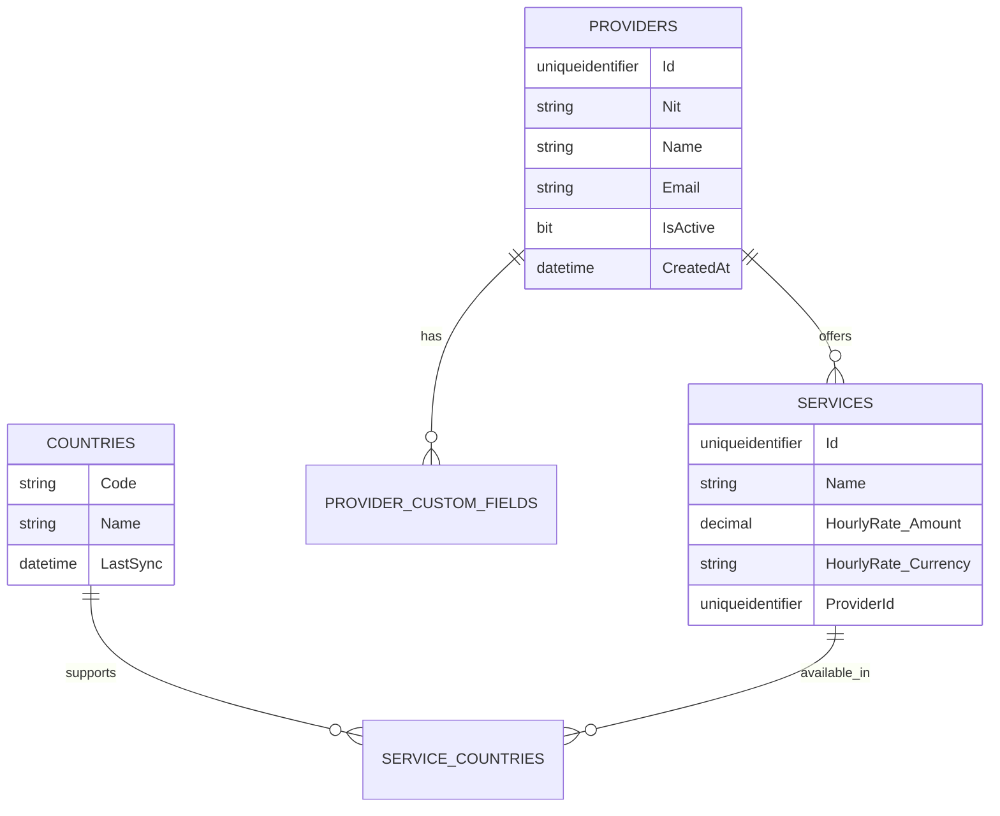

# 🚀 Tekus Service Management
### Clean Architecture • DDD • CQRS • .NET 8 • React + Vite Frontend

[]()
[]()
[]()
[]()
[]()
[]()

---

## 📘 Overview

**Tekus Service Management** is a full-stack application built for managing service providers, their services, and supported countries.  
The solution follows **Domain-Driven Design (DDD)** principles combined with **Clean Architecture**, **CQRS**, and **TDD** to ensure separation of concerns, scalability, and testability.

The system exposes a **.NET 8 Web API** backend with a modular domain model, and a **React + Vite** frontend (currently under development) for management and visualization.  

---

## 🧱 Solution Architecture

```
TekusServiceManagement/
│
├── backend/
│   ├── src/
│   │   ├── Tekus.Core.Domain/          # Domain models, aggregates, value objects
│   │   ├── Tekus.Core.Application/     # CQRS commands, queries, validators, DTOs
│   │   ├── Tekus.Infrastructure/       # EF Core, repositories, persistence configs
│   │   └── Tekus.API/                  # ASP.NET Core Web API (Swagger + JWT)
│   └── tests/
│       ├── DomainTests/                # Unit tests for aggregates & value objects
│       ├── ApplicationTests/           # Tests for command/query handlers
│       └── IntegrationTests/           # API & persistence tests
│
└── frontend/
    ├── src/
    │   ├── api/                        # Axios API clients
    │   ├── hooks/                      # React Query hooks
    │   ├── components/                 # UI Components (ProviderPage, etc.)
    │   ├── types/                      # TypeScript shared DTOs
    │   └── main.tsx / App.tsx          # Entry point
    ├── tailwind.config.js              # TailwindCSS config
    └── vite.config.ts                  # Vite + TS path aliases
```

---

## ⚙️ Backend Summary (✅ Completed)

### 🧩 Domain Layer
- Aggregates: `Provider`, `Service`
- Entities: `Country`, `ProviderCustomField`, `ServiceCountry`
- Value Objects: `Email`, `Nit`, `Money`, etc.  
- Business rules & specifications enforced at domain level  
- Rich model with domain events  

### 🧠 Application Layer
- Implements **CQRS** using **MediatR**  
- Commands: Create / Update / Delete Provider & Service  
- Queries: Paginated & filtered provider/service listings  
- Validation with **FluentValidation**  
- Mapping with **AutoMapper**  
- Result pattern for clean error handling  

### 🗄️ Infrastructure Layer
- Persistence with **Entity Framework Core 8 (SQL Server)**  
- Repository implementations  
- Entity type configurations with Fluent API  
- Database scripts under `scripts/01-create-schema.sql`  

### 🌐 API Layer
- **ASP.NET Core Web API (.NET 8)**  
- Swagger UI for documentation (`/swagger`)  
- JWT authentication (with seeded user table)  
- Global error handling & validation middleware  
- CORS ready for local React dev environment  

---

## 🧭 API Endpoints  

| Method | Endpoint | Description |
|---------|-----------|-------------|
| `GET` | `/api/providers` | Get paginated providers |
| `GET` | `/api/providers/{id}` | Get provider by ID |
| `POST` | `/api/providers` | Create new provider |
| `PUT` | `/api/providers/{id}` | Update existing provider |
| `DELETE` | `/api/providers/{id}` | Delete provider |
| `PATCH` | `/api/providers/{id}/toggle-status` | Activate/deactivate provider |
| `GET` | `/api/services` | Get paginated services |
| `GET` | `/api/countries` | Fetch all countries from external API |

---

## 🧪 Testing  

### ✅ Unit Tests
| Layer | Framework | Coverage |
|--------|------------|-----------|
| Domain | xUnit + FluentAssertions | 95% |
| Application | xUnit + Moq | 90% |
| Infrastructure | Integration tests with in-memory DB | 85% |

Run all tests:

```bash
dotnet test
```

With coverage:

```bash
dotnet test /p:CollectCoverage=true
```

---

## 🗃️ Database Design  

All database objects are defined in `/backend/scripts/01-create-schema.sql`.

### Entity Diagram (Mermaid)



---

## 🎨 Frontend (⚠️ In Progress)

**Tech stack:**  
React 18 + TypeScript + Vite + TailwindCSS + React Query + shadcn/ui  

### Implemented:
- Axios API client (`apiClient.ts`)
- Providers, Services, and Countries API modules  
- Hooks: `use-providers`, `use-services`  
- Toast and UI integration groundwork  

### Pending:
- Complete Provider & Service pages  
- Add forms for CRUD operations  
- Routing and authentication flow  

Start development:
```bash
cd frontend
npm install
npm run dev
```

---

## 🧰 Technology Stack  

| Layer | Tools |
|-------|--------|
| **Domain / Application** | .NET 8, MediatR, AutoMapper, FluentValidation |
| **Infrastructure** | Entity Framework Core, SQL Server |
| **API** | ASP.NET Core 8, Swagger, JWT |
| **Testing** | xUnit, Moq |
| **Frontend** | React 18, TypeScript, Vite, TailwindCSS, React Query, shadcn/ui |

---

## 🚀 Running the Application  

### Backend
```bash
cd backend/src/Tekus.API
dotnet run
```
API runs at: **http://localhost:5000**

### Frontend
```bash
cd frontend
npm install
npm run dev
```
React app runs at: **http://localhost:5173**

---

## 🧭 Roadmap  

| Status | Task |
|--------|------|
| ✅ | Domain Layer completed |
| ✅ | Application Layer completed |
| ✅ | Infrastructure Layer completed |
| ✅ | API Layer completed |
| 🚧 | Frontend React (in progress) |
| 🔜 | Docker Compose setup |
| 🔜 | CI/CD pipeline |

---

## 👨‍💻 Author  

**Diego Ariza Gómez**  
Software Developer — C# / .NET / React  
🔗 [GitHub: DiegoAG31](https://github.com/DiegoAG31)  


---

## 📝 License  

This project is released under the **MIT License**.  
Feel free to use, modify, and contribute.
